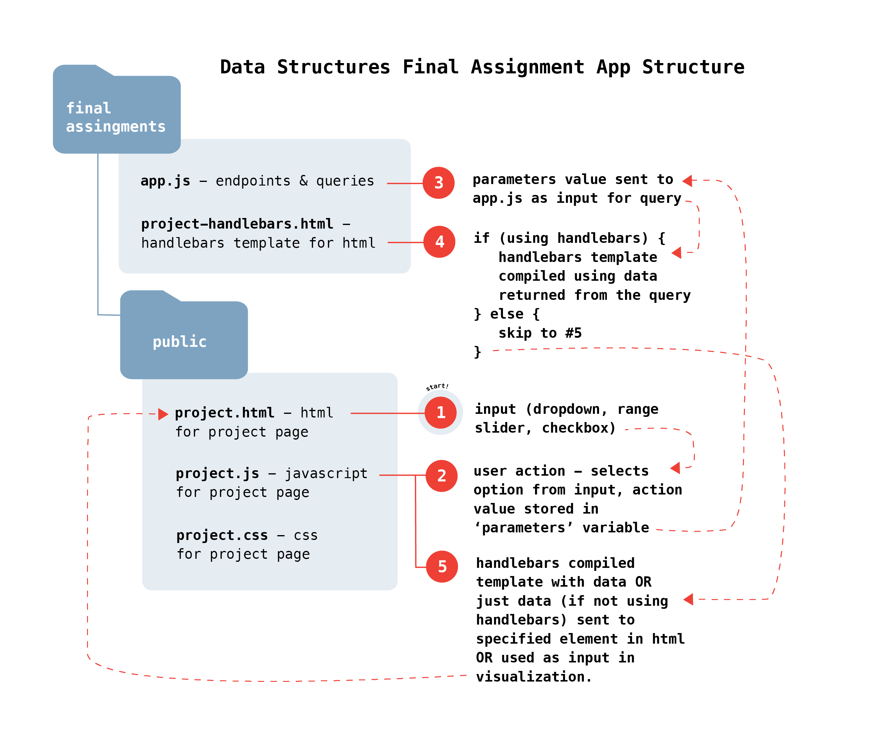

# Data Structures Final Assignment Documentation

[View Final Assignments](http://52.90.218.227:8080)

### General overview of approach




#### A. Data Structures

Assignments 1 & 3 (AA Meeting Map & Temperature Sensor) both use a posgres SQL database. Assignment 2 (Process Blog) uses a DynamoDB noSQL database.

#### B. User Interface

Assignment 1 includes toggle buttons and a circular range slider, assignment 2 includes a dropdown menu, and assignment 3 includes a horizontal slider.

#### C. Queries

Assignment 1 dynamically queries on a range of week days and a range of hours of day, assignment 2 dynamically queries on blog post category (primary key), and assignment 3 dynamically queries on hour of the day.


## Final Assigment 1 - AA Meeting Finder
[View final Assignment 1 instructions](https://github.com/visualizedata/data-structures/blob/master/final_assignment_1.md#final-assignment-1)

Sketched design for interface from Week 11 assignment:


Final result:


#### Overview

The final result has a default view of meetings on the current day, within the next four hours. Users can then add days to their selection and adjust the time range to find meetings within a desired period of time. The map displays each location within the selection, with a popup that includes all meetings at that location. The middle column includes all individual meetings within the selection, and when the user clicks on an individual meeting, the map pans to the location and opens the popup to display any additional meetings that also share the same location.

#### Data Structure

Data for the AA meeting finder was parsed and written to an SQL posgres database ([see Week 7 assignment](https://github.com/marisaruizasari/data-structures/tree/master/Week07))
The database contains two tables, one for individual meeting instances and another for meeting addresses. This reduced redundancy in the database, however it also requires joining on the location primary key contained in both the meetings and addresses tables when querying the database.

#### User Interface

The user interface for the meeting finder includes three key components:

##### 1. Toggle buttons for days of the week

I created these using bootstrap checkboxes, and added a class of 'selected' if the value is equal to the current day:

```javascript
var nowDay = moment().day().toString()

var nowDayString;

var allWeekDays = ['Sundays', 'Mondays', 'Tuesdays', 'Wednesdays', 'Thursdays', 'Fridays', 'Saturdays']

for (var x = 0; x < allWeekDays.length; x++) {
    if (nowDay == x.toString()) {
        nowDayString = allWeekDays[x]
    }
}

var weekdayToggles = $(".btn-secondary")

for (const toggle of weekdayToggles) {
    if (toggle.querySelector("input").id == nowDayString) {
        toggle.classList.add("selected")
    }
    else {
        toggle.classList.remove("active")
    }
}

```

##### 2. Range slider for meeting start hour

I created a range slider using the library roundslider.js, and set the default start and end values to the current hour and current hour + four hours:

```javascript
var nowHour = moment().hour().toString()

console.log(nowDay);
console.log(nowHour);

var slider = $("#appearance1").roundSlider();
let markers;

$("#appearance1").roundSlider({
    sliderType: "range",
    handleSize: "20",
    handleShape: "round",
    showTooltip: true,
    radius: 90,
    value: `${nowHour},${parseInt(nowHour)+4}`,
    min: "0",
    max: "24",
    width: 15,
    startAngle: 89,
    lineCap: "round",
    mouseScrollAction: true,

    drag: function (args) {
        // handle the drag event here
    },
    change: function (args) {
        // handle the change event here
    }
});

var sliderVals = $("#appearance1").roundSlider("option", "value").split(',');
```

##### 3. Clickable meeting instances

With the data that is returned from the query given the inputs from the week day toggles and range slider, I created a div with information about the meeting with a click event that triggers a pan/zoom and popup opening on the map.

```javascript
data.forEach(item => {
            console.log(item)

            var popupInfo = `<p class='add-title'>${item.meeting[0].streetaddress}</p>`;

            var ada = "Not Wheelchair Accessible";
            if (item.ada == "true") {
                ada = "Wheelchair Accessible"
            }

            for (const meeting of item.meeting) {

                popupInfo += `<br> <p class='grp-name'>${meeting.groupname}</p> <p>${meeting.weekday} from ${meeting.starttime} to ${meeting.endtime} ${meeting.ampm}</p>`;
                var parentDiv = document.createElement('div')
                parentDiv.className = "meeting-div"

                var meetingInfo = document.createElement('div')
                meetingInfo.className = "meeting-info"
                meetingInfo.setAttribute('addr', `${meeting.streetaddress.toLowerCase().split("new")[0]}`)
                meetingInfo.innerHTML = `<h3>${meeting.groupname}</h3><br><p class='mtg-type'>${meeting.typename} <br> ${meeting.interest}</p><br><p>${meeting.weekday} from ${meeting.starttime} to ${meeting.endtime} ${meeting.ampm}</p><br><p class="address">${meeting.streetaddress.toLowerCase().split("new")[0]}<br></p><p>${meeting.city}, ${meeting.state} ${meeting.zipcode}</p><br><p class='ada'>*${ada}</p>`

                parentDiv.appendChild(meetingInfo)

                meetingInfo.addEventListener('click', function () {
                    var address = this.getAttribute('addr')

                    $.each(map._layers, function (i, item) {
                        if (this._leaflet_id == address) {
                            this.openPopup();
                            console.log(map);
                            map.setView(this._latlng, 14)
                        }
                    });
                })

                var meetingsDiv = document.querySelector(".meetings")
                meetingsDiv.appendChild(parentDiv)
            }

            var mark = L.marker([item.lat, item.long])
            mark._leaflet_id = `${item.meeting[0].streetaddress.toLowerCase().split("new")[0]}`;
            mark.bindPopup(popupInfo).addTo(markers);

        })

```

#### The Query

The app endpoint:
```javascript

var thisAAQuery = `SELECT lat, long, json_agg(json_build_object('groupname', groupname, 'weekday', weekday, 'starttime', starttime, 'endtime', endtime, 'typename', typename, 'interest', interest, 'hour', hour, 'ampm', ampm, 'ada', ada, 'city', city, 'state', state, 'zipcode', zipcode, 'streetaddress', streetaddress)) as meeting
    FROM aaMeetings
    INNER JOIN aaAddresses ON aaMeetings.addressPK = aaAddresses.addressPK
    WHERE aaMeetings.weekday IN ${weekDays} AND aaMeetings.hour BETWEEN ${req.query.lowerTimeBound} AND ${req.query.upperTimeBound}
    GROUP BY lat, long;`;


    client.query(thisAAQuery, (err, res) => {
        console.log(err, res);
        // console.log(err, res.rows);

        res1.send(res.rows)

        client.end();
    });

```

From the data that is returned, each location marker is added to the map, and a div is populated in the middle column for each meeting instance. See above for further interactivity with the individual meeting instances and map.


#### Key Questions:
1. What information does the end user need? How? Why?
2. From the data on AA's meeting list, which data is relevant for display in this project? How should it be displayed?
3. What does a map marker represent? A meeting group? A meeting? A location?
4. What is the minimum amount of data that can be queried to provide the necessary data for the visual representation?

## Final Assigment 2 - Process Blog
[View final Assignment 2 instructions](https://github.com/visualizedata/data-structures/blob/master/final_assignment_2.md)


#### Key Questions:

1. What information does the end user need? How? Why?
2. Which data is relevant for display in this project? How should it be displayed?
3. What is the default view? Why?
4. What is the minimum amount of data that can be queried to provide the necessary data for the visual representation?

## Final Assigment 3 - Temperature Sensor
[View final Assignment 3 instructions](https://github.com/visualizedata/data-structures/blob/master/final_assignment_3.md)

#### Key Questions:

1. What information does the end user need? How? Why?
2. Which data is relevant for display in this project? How should it be displayed?
3. What is the default view? Why?
4. What is the minimum amount of data that can be queried to provide the necessary data for the visual representation?