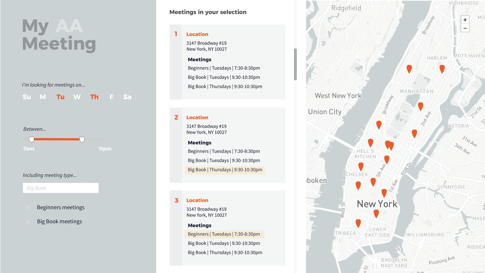

# Data Structures Final Assignment Documentation

[View Final Assignments](http://52.90.218.227:8080)

### General overview of approach


#### A. Data Structures

Assignments 1 & 3 (AA Meeting Map & Temperature Sensor) both use a posgres SQL database. Assignment 2 (Process Blog) uses a DynamoDB noSQL database.

#### B. User Interface

Assignment 1 includes toggle buttons and a circular range slider, assignment 2 includes a dropdown menu, and assignment 3 includes a horizontal slider.

#### C. Queries

Assignment 1 dynamically queries on a range of week days and a range of hours of day, assignment 2 dynamically queries on blog post category (primary key), and assignment 3 dynamically queries on hour of the day.


## Final Assigment 1 - AA Meeting Finder
[View final Assignment 1 instructions](https://github.com/visualizedata/data-structures/blob/master/final_assignment_1.md#final-assignment-1)

Sketched design for interface from Week 11 assignment:


Final result:


#### Overview

The final result has a default view of meetings on the current day, within the next four hours. Users can then add days to their selection and adjust the time range to find meetings within a desired period of time. The map displays each location within the selection, with a popup that includes all meetings at that location. The middle column includes all individual meetings within the selection, and when the user clicks on an individual meeting, the map pans to the location and opens the popup to display any additional meetings that also share the same location.

#### Data Structure

Data for the AA meeting finder was parsed and written to an SQL posgres database ([see Week 7 assignment](https://github.com/marisaruizasari/data-structures/tree/master/Week07))
The database contains two tables, one for individual meeting instances and another for meeting addresses. This reduced redundancy in the database, however it also requires joining on the location primary key contained in both the meetings and addresses tables when querying the database.

#### User Interface

The user interface for the meeting finder includes three key components:

##### 1. Toggle buttons for days of the week

I created these using bootstrap checkboxes, and added a class of 'selected' if the value is equal to the current day:

```javascript
var nowDay = moment().day().toString()

var nowDayString;

var allWeekDays = ['Sundays', 'Mondays', 'Tuesdays', 'Wednesdays', 'Thursdays', 'Fridays', 'Saturdays']

for (var x = 0; x < allWeekDays.length; x++) {
    if (nowDay == x.toString()) {
        nowDayString = allWeekDays[x]
    }
}

var weekdayToggles = $(".btn-secondary")

for (const toggle of weekdayToggles) {
    if (toggle.querySelector("input").id == nowDayString) {
        toggle.classList.add("selected")
    }
    else {
        toggle.classList.remove("active")
    }
}

```

##### 2. Range slider for meeting start hour

I created a range slider using the library roundslider.js, and set the default start and end values to the current hour and current hour + four hours:

```javascript
var nowHour = moment().hour().toString()

console.log(nowDay);
console.log(nowHour);

var slider = $("#appearance1").roundSlider();
let markers;

$("#appearance1").roundSlider({
    sliderType: "range",
    handleSize: "20",
    handleShape: "round",
    showTooltip: true,
    radius: 90,
    value: `${nowHour},${parseInt(nowHour)+4}`,
    min: "0",
    max: "24",
    width: 15,
    startAngle: 89,
    lineCap: "round",
    mouseScrollAction: true,

    drag: function (args) {
        // handle the drag event here
    },
    change: function (args) {
        // handle the change event here
    }
});

var sliderVals = $("#appearance1").roundSlider("option", "value").split(',');
```

##### 3. Clickable meeting instances

With the data that is returned from the query given the inputs from the week day toggles and range slider, I created a div with information about the meeting with a click event that triggers a pan/zoom and popup opening on the map.

```javascript
data.forEach(item => {
            console.log(item)

            var popupInfo = `<p class='add-title'>${item.meeting[0].streetaddress}</p>`;

            var ada = "Not Wheelchair Accessible";
            if (item.ada == "true") {
                ada = "Wheelchair Accessible"
            }

            for (const meeting of item.meeting) {

                popupInfo += `<br> <p class='grp-name'>${meeting.groupname}</p> <p>${meeting.weekday} from ${meeting.starttime} to ${meeting.endtime} ${meeting.ampm}</p>`;
                var parentDiv = document.createElement('div')
                parentDiv.className = "meeting-div"

                var meetingInfo = document.createElement('div')
                meetingInfo.className = "meeting-info"
                meetingInfo.setAttribute('addr', `${meeting.streetaddress.toLowerCase().split("new")[0]}`)
                meetingInfo.innerHTML = `<h3>${meeting.groupname}</h3><br><p class='mtg-type'>${meeting.typename} <br> ${meeting.interest}</p><br><p>${meeting.weekday} from ${meeting.starttime} to ${meeting.endtime} ${meeting.ampm}</p><br><p class="address">${meeting.streetaddress.toLowerCase().split("new")[0]}<br></p><p>${meeting.city}, ${meeting.state} ${meeting.zipcode}</p><br><p class='ada'>*${ada}</p>`

                parentDiv.appendChild(meetingInfo)

                meetingInfo.addEventListener('click', function () {
                    var address = this.getAttribute('addr')

                    $.each(map._layers, function (i, item) {
                        if (this._leaflet_id == address) {
                            this.openPopup();
                            console.log(map);
                            map.setView(this._latlng, 14)
                        }
                    });
                })

                var meetingsDiv = document.querySelector(".meetings")
                meetingsDiv.appendChild(parentDiv)
            }

            var mark = L.marker([item.lat, item.long])
            mark._leaflet_id = `${item.meeting[0].streetaddress.toLowerCase().split("new")[0]}`;
            mark.bindPopup(popupInfo).addTo(markers);

        })

```

#### The Query

For the query, I am joining my two tables for meeting instances and addresses, and creatin a new object of locations with a key value pair for the meeting instances at that location.
```javascript

var thisAAQuery = `SELECT lat, long, json_agg(json_build_object('groupname', groupname, 'weekday', weekday, 'starttime', starttime, 'endtime', endtime, 'typename', typename, 'interest', interest, 'hour', hour, 'ampm', ampm, 'ada', ada, 'city', city, 'state', state, 'zipcode', zipcode, 'streetaddress', streetaddress)) as meeting
    FROM aaMeetings
    INNER JOIN aaAddresses ON aaMeetings.addressPK = aaAddresses.addressPK
    WHERE aaMeetings.weekday IN ${weekDays} AND aaMeetings.hour BETWEEN ${req.query.lowerTimeBound} AND ${req.query.upperTimeBound}
    GROUP BY lat, long;`;


    client.query(thisAAQuery, (err, res) => {
        console.log(err, res);
        // console.log(err, res.rows);

        res1.send(res.rows)

        client.end();
    });

```

From the data that is returned, each location marker is added to the map, and a div is populated in the middle column for each meeting instance. See above for further interactivity with the individual meeting instances and map.


#### Key Questions:
1. What information does the end user need? How? Why?
    The user needs an AA meeting! We don't know when, so I've set the defult view to the current day and time (meetings within the next four hours)

2. From the data on AA's meeting list, which data is relevant for display in this project? How should it be displayed?
    I think the primary information is day, time, and location so I've made that the most prominent. I also added meeting type, meeting interest group, and wheelchair accessibility information.

3. What does a map marker represent? A meeting group? A meeting? A location?
    A map marker represents one location, which can have more than one meeting.

4. What is the minimum amount of data that can be queried to provide the necessary data for the visual representation?
    In this case, the minimum amount of data being queried is meetings on the current day, within a four hour range (the default view).

## Final Assigment 2 - Process Blog
[View final Assignment 2 instructions](https://github.com/visualizedata/data-structures/blob/master/final_assignment_2.md)

Blog mockup sketch:


Final Result:


#### Check dropdown change

```javascript
function dropDownChange() {
    $('select').change(function () {

        if ($(this).val() != 'none') {
            getResults();
        }

        setTimeout(function () {
            main.style.display = 'block';
            img.className += ' shadow'
        }, 150);
    });
}
```

#### The Query

```javascript
app.get('/pblog-page', async function (req, res) {

    var dynamodb = new AWS.DynamoDB();

    var params = {
        TableName: "process-blog-final",
        KeyConditionExpression: "category = :categoryName and #dt between :minDate and :maxDate", // the query expression
        ExpressionAttributeNames: { // name substitution, used for reserved words in DynamoDB
            "#dt": "date"
        },
        ExpressionAttributeValues: { // the query values
            ":categoryName": { S: req.query.category },
            ":minDate": { S: new Date("August 20, 2019").toISOString() },
            ":maxDate": { S: new Date("December 24, 2019").toISOString() }
        }
    };

    var output = {};


    dynamodb.query(params, function (err, data) {
        if (err) {
            console.log('there was an error')
            throw (err);
        }
        else {

            output.blogpost = [];

            for (var i = 0; i < data.Items.length; i++) {
                output.blogpost.push({ category: data.Items[i].category.S, date: moment(data.Items[i].date.S).format("LL"), title: data.Items[i].title.S, entry: data.Items[i].entry.S, fileName: data.Items[i].fileName.S, id: data.Items[i].id.S, number: i })
            }


            fs.readFile('./pblog-handlebars.html', 'utf8', (error, templateData) => {
                var template = handlebars.compile(templateData);
                var html = template(output);
                res.send([html, output]);


            })
        }
    });
```

#### Get results from the selected category, then run scrollama for the scrollable interface

```javascript
function getResults() {

    var parameters = { category: $('select[name=category]').val() };

    //call the endpoint
    change = $.get('/pblog-page', parameters, function (data) {
        console.log(data)
        returnedData = data;
        $('.blogposts').html(data);
    });

    runScrollama();

}
```


#### Key Questions:

1. What information does the end user need? How? Why?
    Here the user is interested in learning about my semester by reading my blog posts! I've categorized them by class so that the user can select the category of interest.

2. Which data is relevant for display in this project? How should it be displayed?
    I've included text from each blogpost, a title, the date of the entry, and an image that related the the entry content.

3. What is the default view? Why?
    The default view is no blog posts (just a home page for the blog). When the viewer selects a category from the dropdown, a query for blog posts in that category returns the information and displays a scrollable interface. In a later iteration of the blog, I would likely make the default view all blogposts sorted by date.

4. What is the minimum amount of data that can be queried to provide the necessary data for the visual representation?
    The minimum would be the primary key, or the category, which is what I am currently querying on.

## Final Assigment 3 - Temperature Sensor
[View final Assignment 3 instructions](https://github.com/visualizedata/data-structures/blob/master/final_assignment_3.md)

Sensor mockup sketch:


Final Result:


####

#### The Query

```javascript
app.get('/sensor', function (req, res1) {


    // Connect to database
    const client = new Client(db_credentials);
    client.connect();

    var secondQuery = `WITH newSensorData as (SELECT sensorTime - INTERVAL '5 hours' as hourlySensorTime, * FROM sensorData)

                  SELECT
                        EXTRACT (YEAR FROM hourlySensorTime) as sensorYear,
                        EXTRACT (MONTH FROM hourlySensorTime) as sensorMonth,
                        EXTRACT (DAY FROM hourlySensorTime) as sensorDay,
                        EXTRACT (HOUR FROM hourlySensorTime) as sensorHour,
                        AVG(sensorValue::int) as averagevalue
                        FROM newSensorData
                        GROUP BY sensorYear, sensorMonth, sensorDay, sensorHour
                        ORDER BY sensorYear, sensorMonth, sensorDay, sensorHour;`;


    client.query(secondQuery, (err, res) => {
        if (err) { throw err }
        else {
            //console.table(res.rows);

            var data = JSON.stringify(res.rows)

            res1.send(res.rows)
        }
    });

});

```

#### Draw the graph using the data returned

```javascript
function drawGraph() {

  // append the svg object to the body of the page
  var svg = d3.select("#my_dataviz")
    .append("svg")
    .attr("class", "graph-svg")
    .attr("width", '100%')
    .attr("height", '300px')
    // height + margin.top + margin.bottom
    .append("g")
    .attr("transform",
      "translate(" + margin.left + "," + margin.top + ")");


  // Add X axis --> it is a date format
  var x = d3.scaleTime()
    .domain(d3.extent(data, function (d) { return d.sensortime; }))
    .range([0, width]);
  svg.append("g")
    .attr("transform", "translate(0," + height + ")")
    .call(d3.axisBottom(x));


  // Add Y axis
  var y = d3.scaleLinear()
    .domain([70, 90])
    // d3.max(data, function (d) { return +d.sensorvalue; })
    .range([height, 0]);
  svg.append("g")
    .call(d3.axisLeft(y));

  // Add the line
  svg.append("path")
    .datum(data)
    //   .filter(function(d) { return d3.timeParse('%Y-%m-%dT%H:%M:%S.%LZ')(d.sensortime) < new Date() })
    .attr("fill", "none")
    .attr("stroke", "white")
    .attr("stroke-width", 1.5)
    .attr("d", d3.line()
      //.x(function (d) { return x(d3.timeParse('%Y-%m-%dT%H:%M:%S.%LZ')(d.sensortime)) })
      .x(function (d) { return x(d.sensortime) })
      .y(function (d) { return y(d.sensorvalue) })
      .curve(d3.curveMonotoneX) // apply smoothing to the line

    )


}
```

#### Check and redraw when slider is dragged

```javascript
// Update the current slider value (each time you drag the slider handle)
function getSliderValue(response, filteredData) {
  slider.oninput = function () {
    value = this.value
    var timeDisplay = this.value
    var ampm = 'am'

    if (value == 0) {
      timeDisplay = 12;
    }
    else if (value >= 12) {
      ampm = 'pm';
      timeDisplay = value - 12;
    }

    var time = document.querySelector('.time-display');

    time.innerHTML = `${timeDisplay} ${ampm}`;


    console.log(value)
    filteredData = response.filter(d => d.sensorhour == value)
    data = filteredData.map(function (d) {
      return { sensortime: d3.timeParse("%Y-%m-%dT%H")(d.sensoryear + '-' + d.sensormonth + '-' + d.sensorday + 'T' + d.sensorhour), sensorvalue: d.averagevalue }
    })
    var graphSVG = document.querySelector('.graph-svg');
    if (graphSVG) {
      graphSVG.parentNode.removeChild(graphSVG);
    }
    drawGraph()
  }
}
```

#### Key Questions:

1. What information does the end user need? How? Why?
    The user wants to know how hot it was in my apartment over the last couple of months!

2. Which data is relevant for display in this project? How should it be displayed?
    Here I am displaying data from each day averaged by hour. With the slider, the user can select a time of day to look at the temperature at that time of day across all of the days for which data was collected.

3. What is the default view? Why?
    The default view is all of the data averaged by hour, because I think it is interesting to see all of it before looking at a specific time of day.

4. What is the minimum amount of data that can be queried to provide the necessary data for the visual representation?
    The minimum amount of data I could query would be the average temperature for one hour across all days, however, since I am showing all of the hours of the day in the default view, I think it makes more sense in this case to filter the data instead of running a new query each time.