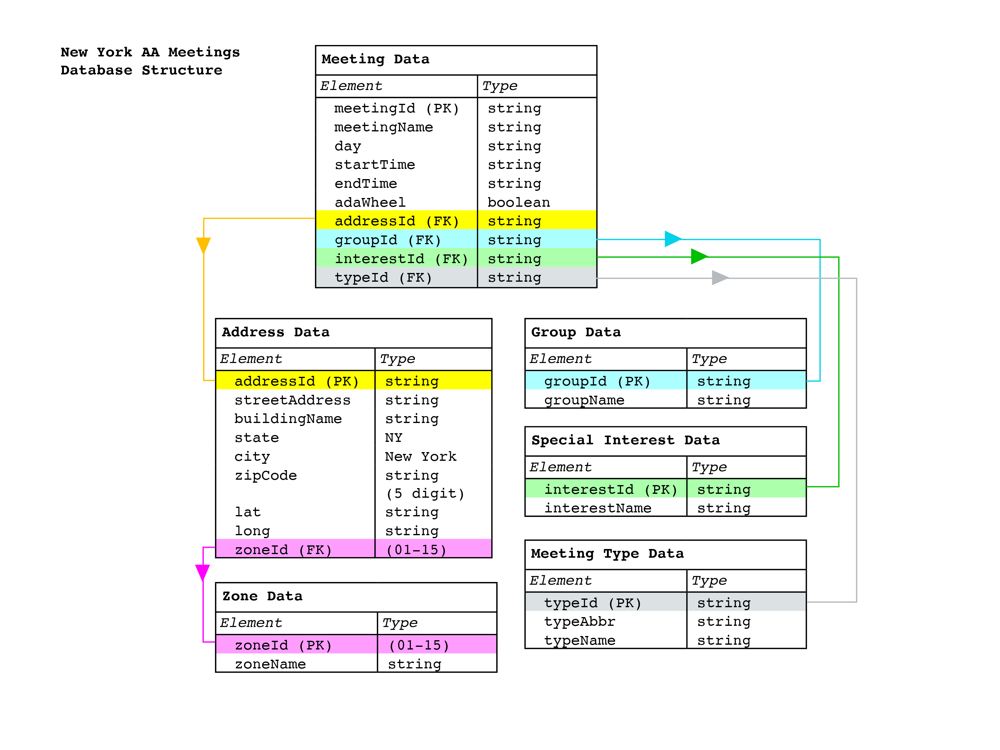

### Week04 Assignment Documentation
# Create a table within aa meetings database 

Instructions
------

### Setup and preparation

You will use Amazon Web Services to host a PostgreSQL database server. Follow [these instructions](https://github.com/visualizedata/data-structures/blob/master/weekly_assignment_04_documentation.md) to set up and access an instance you will use for your SQL work in this class; the setup should take about 30 minutes to complete. 

If you have trouble connecting to your AWS RDS instance, refer to [this guide](https://aws.amazon.com/premiumsupport/knowledge-center/rds-cannot-connect/). 

If you are new to SQL, consider [this tutorial](https://www.linkedin.com/learning/sql-essential-training-2).

## Assignment

### Part One: Plan

Using the Hills text as a starting point (but feel free to strike out on your own), draw a data model for the AA meetings data to be stored in a database. Include all the content/data/variables from the source file that you believe to be relevant, even if you haven't parsed it yet. Upload an image (`png` format) of your drawing to your GitHub repository.  

Some decisions that will help with this drawing:  
1. Will you use a [Normalized Data Model or a Denormalized Data Model](https://www.quora.com/What-is-normalized-vs-denormalized-data)? Why?  
2. When the data comes back out of the database, how should it be structured? Why?  
3. How would you describe the hierarchy of the data?  

### Part Two: Create a table(s) in your database

Modify the following starter code to replace the database credentials with your own. It includes two SQL sample statements that you can modify to accomplish any of the following tasks in your new database, with the help of the `pg` module in Node:  

1. Create a new table.  
2. Remove (delete!) a table.  

**``wa04a.js``** 

```javascript
const { Client } = require('pg');

// AWS RDS POSTGRESQL INSTANCE
var db_credentials = new Object();
db_credentials.user = 'aaron';
db_credentials.host = 'dsdemo.c2g7qw1juwkg.us-east-1.rds.amazonaws.com';
db_credentials.database = 'mydb';
db_credentials.password = process.env.AWSRDS_PW;
db_credentials.port = 5432;

// Connect to the AWS RDS Postgres database
const client = new Client(db_credentials);
client.connect();

// Sample SQL statement to create a table: 
var thisQuery = "CREATE TABLE aalocations (address varchar(100), lat double precision, long double precision);";
// Sample SQL statement to delete a table: 
// var thisQuery = "DROP TABLE aalocations;"; 

client.query(thisQuery, (err, res) => {
    console.log(err, res);
    client.end();
});
```

### Part Three: Populate your database

Use the [`pg` module](https://node-postgres.com/) in Node to insert your AA data in the database you created. Hint: check to make sure you have the correct number of rows! **Note: it is not expected that this data be complete and clean yet. For now, just insert the documents/data you have.**  

Modify the following starter code to replace the database credentials with your own. It includes three SQL queries that you can modify to accomplish the following tasks in your new database, with the help of the `pg` module in Node:  

**``wa04b.js``** 

```javascript
const { Client } = require('pg');
var async = require('async');

// AWS RDS POSTGRESQL INSTANCE
var db_credentials = new Object();
db_credentials.user = 'aaron';
db_credentials.host = 'dsdemo.c2g7qw1juwkg.us-east-1.rds.amazonaws.com';
db_credentials.database = 'mydb';
db_credentials.password = process.env.AWSRDS_PW;
db_credentials.port = 5432;

var addressesForDb = [ { address: '63 Fifth Ave, New York, NY', latLong: { lat: 40.7353041, lng: -73.99413539999999 } }, { address: '16 E 16th St, New York, NY', latLong: { lat: 40.736765, lng: -73.9919024 } }, { address: '2 W 13th St, New York, NY', latLong: { lat: 40.7353297, lng: -73.99447889999999 } } ];

async.eachSeries(addressesForDb, function(value, callback) {
    const client = new Client(db_credentials);
    client.connect();
    var thisQuery = "INSERT INTO aalocations VALUES (E'" + value.address + "', " + value.latLong.lat + ", " + value.latLong.lng + ");";
    client.query(thisQuery, (err, res) => {
        console.log(err, res);
        client.end();
    });
    setTimeout(callback, 1000); 
}); 
```

### Part Four: Check your work

To see what's in your new database table, let's query all of its contents: 

**``wa04c.js``** 

```javascript
const { Client } = require('pg');

// AWS RDS POSTGRESQL INSTANCE
var db_credentials = new Object();
db_credentials.user = 'aaron';
db_credentials.host = 'dsdemo.c2g7qw1juwkg.us-east-1.rds.amazonaws.com';
db_credentials.database = 'mydb';
db_credentials.password = process.env.AWSRDS_PW;
db_credentials.port = 5432;

// Connect to the AWS RDS Postgres database
const client = new Client(db_credentials);
client.connect();

// Sample SQL statement to query the entire contents of a table: 
var thisQuery = "SELECT * FROM aalocations;";

client.query(thisQuery, (err, res) => {
    console.log(err, res.rows);
    client.end();
});
```


Documentation
------

### Setup and preparation 

I began by creating an AWS RDS posgres database named 'aa', and saved my host link and password to a .env file

### Part One: Plan

I created an outline of my database structure using a normalized data approach. This approach reduces redundancy and minimizes error by creating multiple tables that are linked by primary keys (uniquely identifying field) and foreign keys (field in a table that references another table's primary key). The structure of my database focuses on individual meetings (stored in the meeting data table) as the smallest non-repeating unit. The meeting data table references the address data, group data, special interest data, and meeting type data tables. The address data table also references the zone data table. This outline represents my ideal structure for the final database, however it should be noted that the resulting table in this assignment does not match this outline since I currently only have address data and not the other meeting details in my json file. See final notes below for more information.  



### Part Two: Create a table(s) in your database (week04a.js)

I first installed dependencies and referenced my .env file containing my host link and password:
```javascript
// Dependencies
const dotenv = require('dotenv'); // npm install dotenv
dotenv.config({path: '/home/ec2-user/environment/data-structures/.env'});
const hostLink = process.env.HOST_LINK;
const pw = process.env.RDS_PW;

const { Client } = require('pg');
```

I then connected to the AWS RDS postgres database that I created in the setup and preparation part of the assignment, referencing the host link and password stored in my .env file. Note here that the port # does not change (is a constant). 

```javascript
// AWS RDS POSTGRESQL INSTANCE
var db_credentials = new Object();
db_credentials.user = 'asarm379';
db_credentials.host = hostLink;
db_credentials.database = 'aa';
db_credentials.password = pw;
db_credentials.port = 5432;

// Connect to the AWS RDS Postgres database
const client = new Client(db_credentials);
client.connect();

```

Finally I created an empty table named 'aalocations', with column headers for street address, latitute, and longitude. Here we also needed to specify the data type (eg. 'double precision') to ensure that the values retained their intended type (lat/long shouldn't get rounded etc.). Here I also used the 'DROP TABLE' sample code to delete tables after each test until I was satisfied with my results.

```javascript
// Sample SQL statement to create a table: 
var thisQuery = "CREATE TABLE aalocations (streetAddress varchar(100), lat double precision, long double precision);";
// Sample SQL statement to delete a table: 
// var thisQuery = "DROP TABLE aalocations;"; 

client.query(thisQuery, (err, res) => {
    console.log(err, res);
    client.end();
});
```

### Part Three: Populate your database (week04b.js)

I next read my json file containing the geocoded addresses from week03 assignment and parsed the file, saving each address in a new addressesForDb variable:

```javascript
var m09addresses = fs.readFileSync('/home/ec2-user/environment/data-structures/Week03/geoaddressesm09.json')
var addressesForDb = JSON.parse(m09addresses);
// console.log(addressesForDb);
```

For each address in the addressesForDb array, I queried the street address, latitute, and longitude and inserted it into the aalocations table generated in part 2.
```javascript
async.eachSeries(addressesForDb, function(value, callback) {
    const client = new Client(db_credentials);
    client.connect();
    var thisQuery = "INSERT INTO aalocations VALUES (E'" + value.address + "', " + value.lat + ", " + value.long + ");";
    console.log(thisQuery);
    client.query(thisQuery, (err, res) => {
        console.log(err, res);
        client.end();
    });
    setTimeout(callback, 1000); 
}); 
```

### Part Four: Check your work (week04c.js)

Using the starter code, I checked the contents of the aalocations table, console.logging only the row contents:

```javascript
// Sample SQL statement to query the entire contents of a table: 
var thisQuery = "SELECT * FROM aalocations;";


client.query(thisQuery, (err, res) => {
    console.log(err, res.rows);
    client.end();
});
```
The console.log returned the following information (row contents), which was consistent with the request made in part three: 

```javascript

null Result {
  command: 'SELECT',
  rowCount: 4,
  oid: null,
  rows:
   [ { address: '35 E 125 ST New York NY ',
       lat: 40.805958,
       long: -73.940763 },
     { address: '223 E 117TH ST New York NY ',
       lat: 40.7982106,
       long: -73.9382769 },
     { address: '2126 2ND AVE New York NY ',
       lat: 40.7927121,
       long: -73.94069 },
     { address: '22 E 119TH ST New York NY ',
       lat: 40.8021458,
       long: -73.9442327 } ],
       
```

### Final notes

For this assignment I was able to generate a table and store three elements: address, latitude, and longitude. However, as I noted in Week03 assignment, and as reflected in my Part One database structure diagram, I will eventually need to store additional information about each individual meeting (start and end time, meeting type, special interests etc). 

This week I attempted to pull in this addtiional information by going back to my Week02 parsed json file and regenerating my Week03 geocoded json file. I came across two issues in this attempt: 

1. I had trouble parsing of the additional information from the html file from Week01 - I was able to parse the following information:group name, street address, building name, room details, street details, and zip code, but was not able to parse the remaining desired information: meeting type, special interest, wheelchair accessibility, start time, and end time. This was due to the fact that this information is contained in a 'td' element with a different 'style' attribute. 
2. I had trouble creating one json file that contained both the geocoded information (lat/long) as well as the additional information that I was able to parse. Thus for the time being I used only my json file that contained address, lat, and long which is what is reflected above in the assignemnt resutls. 

My next steps are to pull the remaining infromation into one json file and generate multiple tables that follow my database structure diagram. 