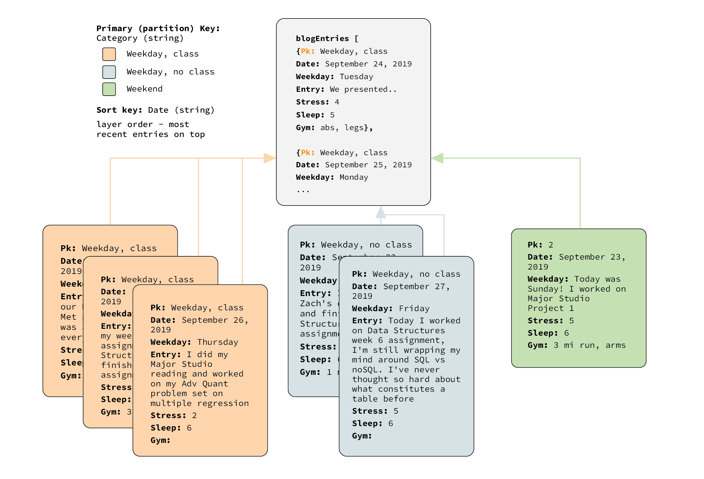

### Week05 Assignment Documentation
# Create noSQL database for final assignment 2

Instructions
------

### Due Tuesday 10/1 at 9:00am

You will start to work with data for the "Process Blog" project (the data source for Final Assignment 2). 

## Setup and preparation

You will use Amazon Web Services to create a table in [Amazon DynamoDB](https://aws.amazon.com/dynamodb/), a NoSQL database service. 

#### Steps to create a table in DynamoDB: 

1. Sign in to the [AWS Console](https://aws.amazon.com/console/) and navigate to [DynamoDB](https://console.aws.amazon.com/dynamodb/home?region=us-east-1).  
2. Click the blue "Create table" button.  
3. Enter a "Table name" (e.g. `processblog`). Enter a "Primary key" name (e.g. `pk`) and choose a data type from the dropdown menu (String, Binary, or Number). I recommend number or string. Click the blue "Create" button.    

## Assignment

### Part One: Plan

Using the Hills text as a starting point (but feel free to strike out on your own), draw a data model for your "Process Blog" data to be stored in this database table. Include all the content/data/variables from your "Process Blog" project that you believe to be relevant. Upload an image (`png` format) of your drawing to your GitHub repository.  

Some decisions that will help with this drawing:  
1. Will you use a [Normalized Data Model or a Denormalized Data Model](https://www.quora.com/What-is-normalized-vs-denormalized-data)? Why?  
2. When the data comes back out of the database, how should it be structured? Why?  
3. How would you describe the hierarchy of the data?  

### Part Two: Create some data for the table in your database

In Part Three of this assignment, you will be using [`putItem`](https://docs.aws.amazon.com/AWSJavaScriptSDK/latest/AWS/DynamoDB.html#putItem-property) in the [AWS SDK for JavaScript in Node.js](https://aws.amazon.com/sdk-for-node-js/). Reference the [DynamoDB class](https://docs.aws.amazon.com/AWSJavaScriptSDK/latest/AWS/DynamoDB.html) for information about the [PutItem method](https://docs.aws.amazon.com/AWSJavaScriptSDK/latest/AWS/DynamoDB.html#putItem-property) and data types. The documentation shows how the items should be mapped and how to specify data types. In preparation for Part Three, the following starter code creates several "Items" destined for DynamoDB (adhering to the expected Item attributes and values), storing them in an array named `blogEntries`: 

```javascript
var blogEntries = [];

class BlogEntry {
  constructor(primaryKey, date, entry, happy, iate) {
    this.pk = {};
    this.pk.N = primaryKey.toString();
    this.date = {}; 
    this.date.S = new Date(date).toDateString();
    this.entry = {};
    this.entry.S = entry;
    this.happy = {};
    this.happy.BOOL = happy; 
    if (iate != null) {
      this.iate = {};
      this.iate.SS = iate; 
    }
    this.month = {};
    this.month.N = new Date(date).getMonth().toString();
  }
}

blogEntries.push(new BlogEntry(0, 'August 28 2019', "Yay, first day of class!", true, ["Cheez-Its", "M&Ms"]));
blogEntries.push(new BlogEntry(1, 'October 31, 2015', "I piloted my first solo flight!", true, ["pancakes"]));
blogEntries.push(new BlogEntry(2, 8675309, "867-5309?", false));
blogEntries.push(new BlogEntry(3, 'September 25, 2019', "I taught my favorite students.", true, ["peas", "carrots"]));

console.log(blogEntries);
```

### Part Three: Populate your database

Use the [AWS SDK for JavaScript](https://docs.aws.amazon.com/AWSJavaScriptSDK/latest/) to work with your DynamoDB table in Node.js. Install with:  
`npm install aws-sdk`

### Set up permissions for your Cloud9 EC2 instance to be able to access DynamoDB: 

[This video](https://drive.google.com/open?id=11ZwSwG6PZUwcPCNOk29RLqRn8qxcFCz-) walks through the instructions in this section (must be signed into New School Google account to view). 

1. Open your Cloud9 environment.  
2. In the AWS Console, navigate to the `IAM` service. In the left-hand column, click **Roles**. Click the blue **Create role** button. Under the header **Choose the service that will use this role**, click **EC2** then click **Next: Permissions**. In the **Filter policies** search field, type `dynamodb` to filter the options to show only permissions related to DynamoDB; click **`AmazonDynamoDBFullAccess`**, making sure that the checkbox is selected; click the blue **Next: Tags** button. Click the blue **Next: Review** button. In the **Role name** field, give this role a name. Click the blue **Create role** button.  
3. In the AWS Console, navigate to the `EC2` service. Click **Running Instances**. Click on name of the instance that is associated with your Cloud9 environment for this course (it should indicate that it's highlighted with a blue background and a blue filled check button); the naming convention for Cloud9 EC2 instances is `aws-cloud9-` + the name of your C9 environment + some identifier string. Click the **Actions** dropdown. In the **Instance Settings** menu, select **Attach/Replace IAM Role**. In the **IAM role** dropdown, select the role you created in the previous step. Click the blue **Apply** button.  
4. Your Cloud9 environment (and the underlying EC2 instance) now has permission to access DynamoDB. A lot of the AWS documentation guides you to manage permissions with an "AWS Access Key" (a.k.a. "Access key ID" and "Secret access key"). **PLEASE DON'T EVER DO THIS!!!** If these keys ever make it onto GitHub, your AWS will be comprised within a few minutes, often incurring charges in the tens of thousands of dollars. You can avoid this by always using IAM permissions (as you just did in the previous three items in this list) and **NEVER, EVER USING A SECRET ACCESS KEY**. 

### Starter code:  

The following starter code uses the AWS SDK to put the first Item into the DynamoDB table (from the `blogEntries` array created in the previous step). Modify this code to put **at least three items** into your table. First, modify the `params` object with your Item(s) and TableName. If you created your table in a different region (the starter code uses region `us-east-1`), you should modify `region` in the starter code. Additionally, you will need to come up with a way to loop over all of the items in your array, making sure not to attempt more than 2 puts per second (like you did in the previous assignment, as you iterated over each request to your PostgreSQL endpoint). Check your table in the AWS Console (look in the "Items" tab) to make sure your items (at least three!) were successfully put into the table.   

```javascript
var AWS = require('aws-sdk');
AWS.config = new AWS.Config();
AWS.config.region = "us-east-1";

var dynamodb = new AWS.DynamoDB();

var params = {};
params.Item = blogEntries[0]; 
params.TableName = "processblog";

dynamodb.putItem(params, function (err, data) {
  if (err) console.log(err, err.stack); // an error occurred
  else     console.log(data);           // successful response
});
```

Documentation
------

### Setup and preparation

I created a table in DynamoDB named "dsProcessBlog", with a primary/partition key of Category (string) and sort key of Date (string). 
Since I decided to use a sort key in combination with the partition key, I wanted the primary/partition key to be a higher level grouping that could then be further sorted by date. In this table the pk of "Category" represents a classification of weekday (weekday with no class, weekday with class, or weekend).


### Part One: Plan

For this assignment I wanted to play around with partition and sort key combinations, and chose to create a week of mock blog enrtries using Sunday-Friday of this week. Here I am recording information about my daily activities at school, as well as my stress and sleep patterns, and physical activity. 
My denormalized data model treats each blog entry as its own entity that can contain a range of components (enrty text, stress level, hours of sleep, gym activities). It is not necessary for each entry to have all of the components, and thus this model gives the database and entries more flexibility. 
Each of the colored rectangles represents one blog entry. The model represents groupings by primary key using color (weekday with no class = orange, weekday with class = blue, weekend = green), and repsents the date sort key through layering (top layer representing the most recent date within the pk category).
The grey rectangle at the top represents one document containing and array of objects of each of the blog entries (colored arrows flow from each entry to this document).



### Part Two: Create some data for the table in your database

I adapted the starter code to create constructors for my blogEntries array. Here I am including the category pk (string) and date sk (string), as well as weekday (string), entry (string), sleep (N), stress (N), gym (double string), and month (N). 

```javascript
// create blog entries array

let blogEntries = [];

class BlogEntry {
  constructor(Category, date, weekday, entry, stress, sleep, gym) {
    this.Category = {};
    this.Category.S = Category;
    this.Date = {}; 
    this.Date.S = new Date(date).toDateString();
    this.weekday = {};
    this.weekday.S = weekday;
    this.entry = {};
    this.entry.S = entry;
    this.stress = {};
    this.stress.N = stress.toString(); 
    this.sleep = {};
    this.sleep.N = sleep.toString();
    if (gym != null) {
      this.gym = {};
      this.gym.SS = gym; 
    }
    this.month = {};
    this.month.N = new Date(date).getMonth().toString();
  }
}
```
I then wrote six mock blog entries and pushed them to my blogEntries array. I console logged the results to make sure everything was added to the array correctly (console logging is becoming my best friend):

```javascript
// write and push blog entries 

blogEntries.push(new BlogEntry('Weekend', 'September 22, 2019', "Sunday", "Today was Sunday! I worked on Major Studio Project 1", 3, 7, ["3mi run", "arms"]));
blogEntries.push(new BlogEntry('Weekday, no class', 'September 23, 2019', "Monday", "I went to Zach's office hours and finished Data Structures week 5 assignment (How is it already week 5!?)", 5, 6, ["1 mi jog"]));
blogEntries.push(new BlogEntry('Weekday, class', 'September 24, 2019', "Tuesday", "We presented our Major Studio Met projects, it was awesome to see everyone's work.", 4, 5, ["abs", "legs"]));
blogEntries.push(new BlogEntry('Weekday, class', 'September 25, 2019', "Wednesday", "I presented my week 5 assignment in Data Structures and finished my clock assignment for DVIA", 7, 5, ["3mi run", "arms"]));
blogEntries.push(new BlogEntry('Weekday, class', 'September 26, 2019', "Thursday", "I did my Major Studio reading and worked on my Adv Quant problem set on multiple regression", 2, 6));
blogEntries.push(new BlogEntry('Weekday, no class', 'September 27, 2019', "Friday", "Today I worked on Data Structures week 6 assignment, I'm still wrapping my mind around SQL vs noSQL. I've never thought so hard about what constitutes a table before", 1, 7));


// console.log(blogEntries);
```
### Part Three: Populate your database

Lastly, I used putItem to populate the dsProcessBlog DynamoDB database I created in the setup and preparation step. Here we had two key challenges: 1. we needed to iterate over all the entries to populate the table in a loop, 2. we needed to not attempt more than 2 puts per second.
This was the most challenging step for me coding wise and conceptually. I started by creating a for loop to iterate over the blogEntries array, which worked and populated the table with my entries, but did not address the number of puts per second. 

```javascript

for (var i=0; i<blogEntries.length; i++){
    params.Item = blogEntries[i]; 
     params.TableName = "dsProcessBlog";

    dynamodb.putItem(params, function (err, data) {
        if (err) console.log(err, err.stack); // an error occurred
         else     console.log(data);           // successful response
    });
    
}
```

To address the puts per second, I wanted to use the setTimeout method we used last week. I referenced my week04b.js script to pull the async.eachSeries and setTimeout callback code. 
My biggest challenge here was adapting the code to fit the goals of this week - I got confused with the input for the params.Item component, and kept try to set it to blogEntries which would return an error, or blogEntries[0] which would return only the first blog entry in the array. 
Since I'm new to javascript I didn't see that the 'value' argument needed to be added since this is the 'iteratee' (equivalent to i in a for loop). My final async.eachSeries code block was able to populate my table with all 6 entries using setTimeout:

```javascript
// populate noSQL database with blog entries 

    
     var AWS = require('aws-sdk');
    AWS.config = new AWS.Config();
    AWS.config.region = "us-east-1";

    var dynamodb = new AWS.DynamoDB();
  
    async.eachSeries(blogEntries, function(value, callback) {

    var params = {};
    
    params.Item = value;   

    params.TableName = "dsProcessBlog";
    
    dynamodb.putItem(params, function (err, data) {
        if (err) console.log(err, err.stack); // an error occurred
         else     console.log(data);           // successful response
    });
    
    setTimeout(callback, 1000); 
});

```

Finally, my populated table: 

