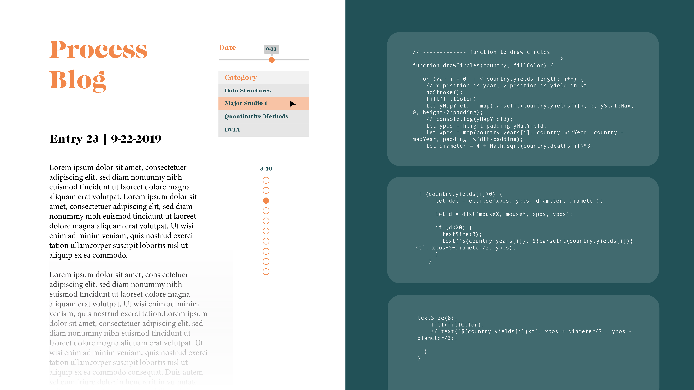
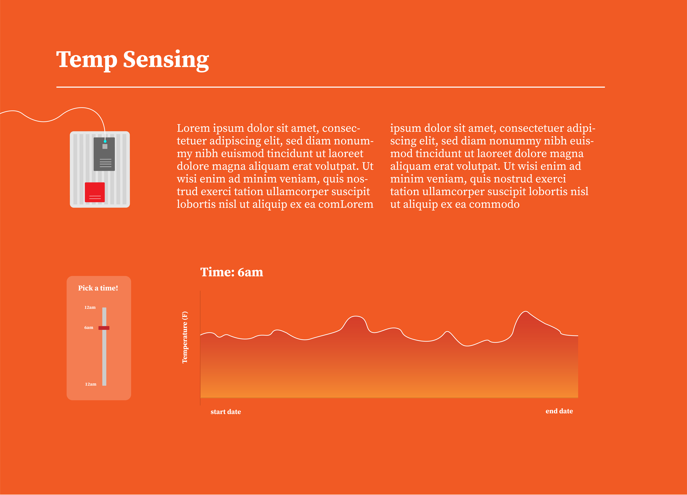

### Week11 Assignment Documentation
# AA Map Interface Design

What will the visualization look like? Will it be interactive? If so, how?
- The visualization will be a map with selection filters for time, day, and meeting type.

How will the data need to be mapped to the visual elements?
- Map with points for each location for the given selection, scrollable area with each meeting at each location.

For that mapping, what needs to be done to the data? Be specific and clear. Will it require filtering, aggregation, restructuring, and/or something else? How will this be done?
- I need to join my two tables of meetings and locations, and filter based on meeting day, time, and type.

What is the default view (if any)?
- Default will be meetings on the current day, after the current time

What assumptions are you making about the user?
- They need an AA meeting, are based in Manhattan, know what time, day, and type of meeting they want (instead of wanting to see all possible meetings at once)

# Process Blog Interface Design

What will the visualization look like? Will it be interactive? If so, how?
- Yes, the visualization will allow users to filter by category with a drop down menu, and also filter by date using a range slider. 

How will the data need to be mapped to the visual elements?
- The code should appear in a block on the left, and each blog post will be scrollable in the righthand area

For that mapping, what needs to be done to the data? Be specific and clear. Will it require filtering, aggregation, restructuring, and/or something else? How will this be done?
- The data will need to be filtered by date and category, which I have as my primary and sort key in my database.

What is the default view (if any)?
- The default view will be the first date of entries for each category.

# Temperature Sensor Interface Design

What will the visualization look like? Will it be interactive? If so, how?
- Yes, the visualization will allow users to choose a time of day and view temperature at this time for the entire data collection period. 

How will the data need to be mapped to the visual elements?
- This viz will be a line graph, each day will have one point on the line for the selected time of day

For that mapping, what needs to be done to the data? Be specific and clear. Will it require filtering, aggregation, restructuring, and/or something else? How will this be done?
- The data will need to be filtered by time

What is the default view (if any)?
- See sketch, one view

What assumptions are you making about the user?
- They are comfortable with line graphs, are interested in my temp data!